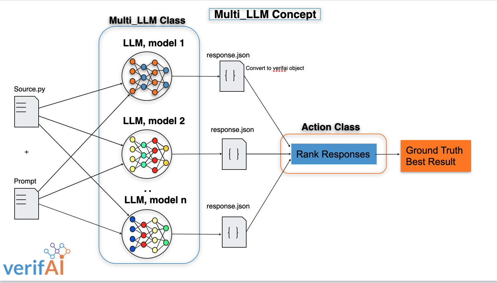

# Multi LLM

VerifAI Implementation of invoking multiple large language models concurrently and ranking results


## Quick-Start

For further information look to [Running the Multi_LLM Application](#running-the-application) inside of [Useage](#useage)

### Installation

`pip3 install multillm`

Edit the [config file](#config-json) to point to your google and openai API keys. 

### Basic Example
`multillm -c config.json -prompt "write a python function to determine whether a given number is prime"`

The above example will run the [config.json](config.json) with the provided prompt. 

<details>
	<summary><strong>Output of the above multillm command</strong></summary>
	
#### multi llm response
1. *GPT's implementation of the sort_integers function is cleaner and more readable compared to BARD's implementation. They use the built-in sorted function which returns a new sorted list, while BARD uses the sort method which modifies the original list in-place. GPT's implementation is more intuitive and follows best practices for Python programming.*

2. *BARD's implementation is functional but could be improved. They use the sort method to sort the list in-place, which can be confusing if someone expects the function to return a new sorted list. However, their implementation is still correct and will sort the list correctly.*
</details>

## Usage

The Multi_LLM application provides a powerful and efficient solution for invoking multiple large language models (LLMs) concurrently and effectively managing their outputs. This section guides you through the steps required to run the application using various command-line options and configuration files.

### Prerequisites

Before running the Multi_LLM application, ensure that you have the following prerequisites in place:

- Python >= 3.8 installed on your system.


### Command-Line Usage

The Multi_LLM application can be executed from the command line using the following command structure:

```
multillm -c <config_file> -prompt "<prompt_text>"
```

- `<config_file>`: The path to the configuration file containing LLM details.
- `<prompt_text>`: The prompt text you want to provide to the language models.

### Config Files

The configuration file [config.json](config.json) defines the language models and their associated parameters.  See [Config JSON](#config-json) for more information.
It follows the structure outlined below: 

<details>
	<summary><strong>Example Config.json file</strong></summary>

```json
{
    "Config": {
        "Multi_LLM": {
            "llms": [
                {
                    "file": "bard.py",
                    "class_name": "BARD",
                    "model": "chat-bison@001",
                    "credentials": "/path/to/google/key.json"
                },
                {
                    "file": "GPT.py",
                    "class_name": "GPT",
                    "model": "gpt-3.5-turbo",
                    "credentials": "/path/to/openai/key.json"
                }
            ]
        }
    }
}
```
</details>

### Running the Application

To run the Multi_LLM application, follow these steps:

1. Download the [config.json](config.json) file with the desired language model configurations.

2. Open a terminal and navigate to the directory containing the `multi_llm.py` script.

3. Execute the following command, replacing `<config_file>` with the actual path to your configuration file and `<prompt_text>` with the desired prompt text:
   ```bash
   multillm -c <config_file> -prompt "<prompt_text>"
   ```

4. The application will run the specified language models concurrently, process their responses using the provided prompt, and display the results.


### Implementing Your Own BaseLLM

This section will guide you through the process of creating your own `BaseLLM` implementation by extending the existing class and customizing it to fit the requirements of your specific language model.

### Getting Started

To begin, follow these steps:

1. **Create a New Python File**: Start by creating a new Python file in your project directory, or within the appropriate package, where you'll define your custom `BaseLLM` implementation.

2. **Import BaseLLM**: Import the `BaseLLM` class from the provided code. You'll use this as the parent class for your custom implementation.

```python
from multillm.BaseLLM import BaseLLM
```

### Adding a new LLM interface

Now that you've imported the `BaseLLM` class, you can add a new LLM. Follow these steps:

1. **Create Your Class**: Define a new class that inherits from `BaseLLM`.

```python
class NewLLM(BaseLLM):
    pass
```

2. **Customize Attributes**: Customize the attributes of your custom class to match the requirements of your language model. You can add new attributes or modify existing ones as needed.

```python
class NewLLM(BaseLLM):
   
    def __init__(self, **kwargs):
        # Customize initialization as needed
        super().__init__(**kwargs)
```

3. **Implement Methods**: Implement the *required methods*: `get_response()` and `get_content()`. The `get_response()` method should execute your language model with the provided prompt, and the `get_content()` method should extract relevant content from the response.

```python
class NewLLM(BaseLLM):
    # ... (attributes and __init__ method as before)
    
    def get_response(self, prompt):
        # Implement your language model interaction here
        response =  <"Generated response from new LLM model based on prompt">
        return response
    
    def get_content(self, response):
        # Implement content extraction from the response
        content = "Extracted content from response"
        return content
```

4. **Usage**: You can now use your custom `NewLLM` class in your application code. Instantiate it, call its methods, and integrate it into your application's workflow.

```python
custom_llm = NewLLM(model="custom_model", credentials="your_credentials")
prompt = "Generate something amazing."
response = custom_llm.get_response(prompt)
content = custom_llm.get_content(response)
print(content)
```

By extending the provided `BaseLLM` class, you can easily create custom language model implementations tailored to your project's needs. This structured approach ensures consistency and modularity in your codebase, allowing you to focus on the unique aspects of your language model while leveraging the foundational structure provided by `BaseLLM`.

## Example GPT interface
<details>
  <summary><strong>Example Model GPT.py</strong></summary>
	
```python
	
import os,sys
import openai
import json
from multillm.BaseLLM import BaseLLM
from multillm.Prompt import Prompt


# Openai gpt interface
"""
The GPT class extends the BaseModel class,  implements the required methods: get_response() and get_content().
The get_response() method takes a response parameter and returns the content of the first response in the given response object.
"""
class GPT(BaseLLM):

    #implement here
    def __init__ (self, **kwargs):
        # add values here directly or if kwargs are specified they are taken from the config file
        defaults  = {
            "class_name" : "GPT",
            "model" : "gpt-3.5-turbo",
            "credentials" : "key.json"
        }

    # Get Content -- Required Method
    def get_content(self, response):
    
        """ Get the text from the response of an LLM
        e.g.: openai returns the following response, this method should return the 'content'.
        { "choices": [{{"message": 
			{"content": "def binary_sort(arr):"}}}]}
        """
        return response["choices"][0]["message"]["content"]

    # Get Response -- Required Method, Call openai API
    def get_response(self, prompt):
        # setup prompt for API call
        messages=[]
        
        messages.append( {"role": prompt.get_role(), "content" : prompt.get_string()})
        if prompt.context:
            messages.append({"role": prompt.get_role(), "content" : prompt.get_context()})
        
        # Read Credentials file specified in the config.json, setup for openai
        if not os.path.exists(self.credentials):
            print('error (multi_llm): could not find openai_credentials: {0}' .format(self.credentials))
            return 

        # Open the file for reading
        try:
            with open(self.credentials, 'r') as file:
                # Load the JSON data from the file
                data = json.load(file)
                openai.organization = data['organization']
                openai.api_key = data['api_key'] 

        except Exception as e:
            print('(multi_llm) error: could not load credentials {0} : {1}' .format(self.credentials,str(e)))
            return
                    
        # do API call
        response = openai.ChatCompletion.create(
            model = self.model,
            messages=messages
        )
        if response:
            return(self.get_content(response))
        else:
            return response
```
</details>
 
## Config JSON

### Using the `config.json` File

The `config.json` file offers a convenient way to configure and load multiple language models using the "Multi_LLM" framework. This section will guide you through the process of creating and utilizing a `config.json` file to load and use specific language models in your application.

### Configuration Setup

To get started, follow these steps to configure your `config.json` file:

1. **Create a Configuration File**: Create a new file named `config.json` in your project directory or the desired location.

2. **Configure LLMs**: Define the language models you want to use within the `"llms"` array. Each model configuration includes details such as the Python file containing the model implementation, class name, model name, and credentials file path.

```json
{
    "Config": {
        "Multi_LLM": {
            "llms": [
                {
                    "file": "bard.py",
                    "class_name": "BARD",
                    "model": "chat-bison@001",
                    "credentials": "/path/to/google/key.json"
                },
                {
                    "file": "GPT.py",
                    "class_name": "GPT",
                    "model": "gpt-3.5-turbo",
                    "credentials": "/path/to/openai/key.json"
                }
            ]
        }
    }
}
```

### Loading Models Using Multi_LLM

After creating the `config.json` file, you can use the "Multi_LLM" framework to load and utilize the configured models in your application. Follow these steps:

1. **Instantiate Multi_LLM**: Create an instance of the `Multi_LLM` class and provide the path to your `config.json` file.

```python
from Multi_LLM import Multi_LLM

# Specify the path to your config.json file
config_path = "path/to/config.json"

# Instantiate Multi_LLM
multi_llm = Multi_LLM(config=config_path)
```

2. **Run Models**: Use the `run` method to run the loaded models and process their responses. Provide a prompt and an optional action chain if needed. The responses from each model will be returned in a dictionary.

```python
prompt = "Translate this sentence."
action_chain = None  # You can define an action chain if required

responses = multi_llm.run(prompt, action_chain)
print(responses)
```

## Action Class
This is the interface class which we use to operate on the output while still in parallel. Action class instances are define by the user and can be chained indefinitely with other Actiion instances.
There are two methods that are used to interface with the class: `apply()` and `then()`.
The first, `apply()` is what is used internally to call the methods we register. Registration is as follows:
```python
# Write an interfacing function, a simple in/out
def capitalize(data):
	data = data.upper()
	return data
	
def lower(data):
	data = data.lower()
	return data
	
# Create the respective objects
action1 = Action(operation=capitalize)
action2 = Action(operation=lower)

# Create the chain of actions
action_chain = action1.then(action2)
```
What we did was create some actions that are simple I/O operations on data. We can then chain them together using the `then()` method mentioned above. The order of operations for then is left to right, in this case action1 will go first then action2. These actions can be tailored to your own specification, since the actions are serial, you can specify the information that is going to be passed into the function and what information will be returned.

After you have created the action chain you can pass this into the `Multi_LLM.run()` method and run.

### Action Chain

The `Action Chain` is a core component of processesing LLM output. In the provided [example.py](examples/example.py) we see the first action defined is for processing the LLM response and extracting the code alone from the response. This could be a first of many steps, what could follow could be saving the code to the file or extracting information through the `ast` module. The actions are meant to be ran on each of the model's outputs so they should be generalized for use.

## Rank Class
The `Rank` class is identical in functionality to the `Action` class, though the use is different. While the `Action` class is used to accept and modify data in each of the models, the `Rank` class' purpose is to modify the final combined output of the LLMs. 
This output is stored in a dictionary keyed by the model's names. The `Rank` class's methods should be written to take this data and operate on it. 
```python
#Write an interfacing function, a simple print
def print_llms(dictionary):
	for key,val in dictionary.items():
		print(key, val)

# Create Rank instances
rank_object = Rank(operation=print_llms)

# Running the LLM, assuming an instance of 
# Multi_LLM named mLLM
results = mLLLM.run(prompt, action_chain, rank_object)
```
In the above code we are doing very similar actions as those seen above. The methodoly is the same. In this case we only have a single object, so instead of creating a `rank_chain` we simply pass in our single instantiated object.
## Architecture
### High Level Overview

### Multi_LLM Class
This is the highest level, here we can instantiate MultiLLM objects using either config files (see [config files](###Config-Files)) or manually instantiating a custom or hosted LLM. 
In this class we call multiple LLMs concurrently and then we can operate on the results of each in parallel using the [Action Class](###Action-Class).

The "Multi_LLM" Python code provides a versatile framework for managing and orchestrating multiple language models (LLMs) within a single application. This code is designed to enhance the efficiency of working with language models by enabling concurrent execution, response processing, and model loading from configuration files. The key features and components of the code include:

- **Concurrent Model Execution:** The code allows you to run multiple language models concurrently, facilitating efficient utilization of computational resources. This is particularly useful for scenarios that involve processing multiple prompts or tasks simultaneously.

- **Action Chain Processing:** The framework supports the concept of "action chains," which enable you to preprocess model responses using a sequence of predefined actions. This empowers you to refine and enhance the output generated by the language models.

- **Model Loading from Configuration:** You can load LLMs from a configuration file. This JSON-based configuration includes essential details about each model, such as the model class, associated credentials, and file paths. The code can dynamically load these models, making it easy to add new models or modify existing ones without altering the core codebase.

- **Redis Integration:** The code features optional integration with a Redis instance. It checks for a successful Redis connection and adjusts its behavior accordingly. If Redis connectivity is not established, the code gracefully handles the situation by setting a flag that reflects the absence of a Redis connection.

- **Simplified Model Registration:** The code includes a straightforward method to register models within the framework. This allows for the inclusion of custom LLM implementations while ensuring that the models are appropriately organized and accessible for execution.

By using the "Multi_LLM" Python code, developers can streamline their interactions with multiple language models, seamlessly integrating them into various applications or projects. The code promotes modularity, reusability, and parallelism in working with language models, ultimately enhancing the user experience and productivity.

### BaseLLM

`BaseLLM` is designed to serve as the basis for implementing various language model classes. This `BaseLLM` class encapsulates essential attributes and methods necessary for interfacing with language models. The code establishes a structured foundation for building specific language model implementations and harmonizes their interaction within a larger application context.

Key features and components of the code include:

- **Attributes for Language Models:** The `BaseLLM` class declares a set of attributes, such as `model`, `roles`, `messages`, `temp`, `api_key`, `max_tokens`, and `args`, that are pertinent to language models. These attributes are meant to be customized and adapted as needed for specific model implementations.

- **Customizable Initialization:** The `__init__()` method in the `BaseLLM` class facilitates flexible instantiation of model instances by allowing the specification of custom values via keyword arguments. It enables the convenient configuration of attributes like `name`, `credentials`, `model`, and `class_name`.

- **Placeholder Methods:** The `BaseLLM` class defines two placeholder methods: `get_response()` and `get_content()`. The `get_response()` method is designed to receive a `Prompt` object and run the associated language model with the provided prompt. The actual implementation of this method is expected to be customized in derived classes to perform the model-specific interactions. Similarly, the `get_content()` method is meant to be implemented by deriving classes, providing an interface to extract relevant content from model responses.

- **Structured Framework:** The code encapsulates a structured framework that abstracts common functionalities of language models. By inheriting from the `BaseLLM` class, developers can focus on implementing model-specific interactions while leveraging the established structure for attribute handling and method placeholders.

`BaseLLM` aims to streamline the development of specific language model implementations by providing a consistent structure and standardized attributes. Developers can extend this base class to create custom language model classes that seamlessly integrate into the broader application ecosystem. This modular approach promotes reusability, maintainability, and consistent design patterns when working with various language models.

## Contribution

You can contribute by extending the models located in [models](models). See the [BaseLLM](#baselmm) section for more information on the necessary mechanisms for extending the BaseLLM class.
For further information contact [ethansaurusrex](https://github.com/ethansaurusrex)
