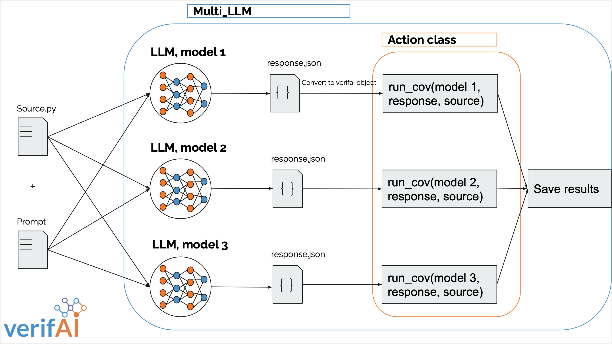

# Multi LLM

VerifAI Implementation of invoking multiple large language models concurrently and ranking results

## Use

### Config Files
Using config files is as follows:
```
{ "TestGuru" :
	{ "model" : "openai",
	  "temp": 0.7,
	  "args": { "arg1":"val1",
		        "arg2":"val2" 
			  }
	}
    { "model" : "google-palm",
	  "temp": 0.9,
	  "args": { "arg1":"val1",
		        "arg2":"val2" 
			  }
	}
}
		  
```
## Architecture
### High Level Overview

### Multi_LLM Class
This is the highest level, here we can instantiate MultiLLM objects using either config files (see [config files](###Config-Files)) or manually instantiating a custom or hosted LLM. 
In this class we call multiple LLMs concurrently and then we can operate on the results of each in parallel using the [Action Class](###Action-Class).
### Action Class
This is the interface class which we use to operate on the output while still in parallel. Action class instances are define by the user and can be chained indefinitely with other Actiion instances.
### Eval Class
In the section labeled "save results" we can see the convergence of the results of Action classes. Here the Eval Class operates on the results of Action classes in parallel. Since the Eval class is not parallel we can run into bottlenecks if the Eval Class's methods are intensive.
